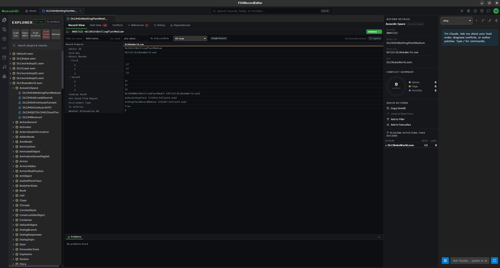
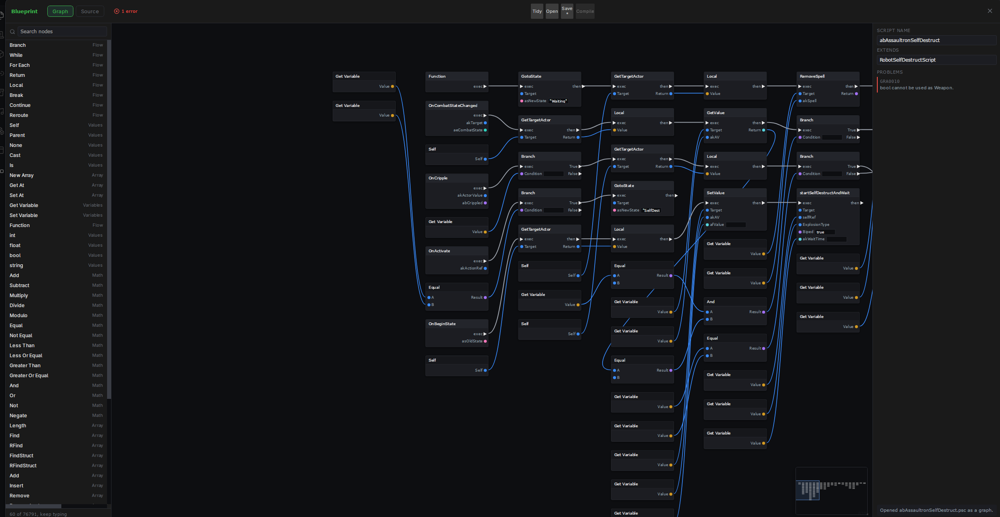
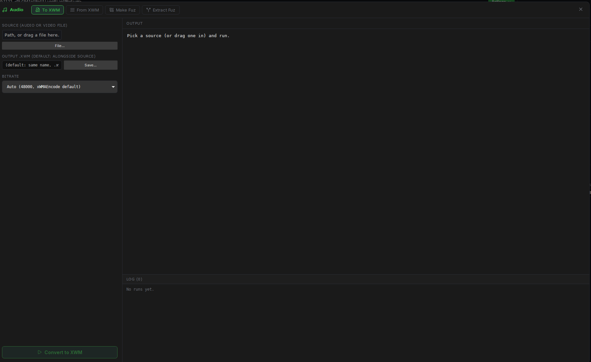
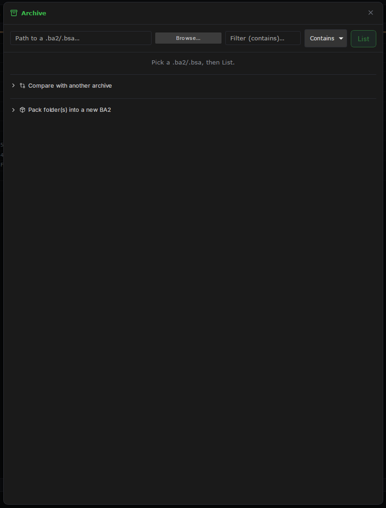
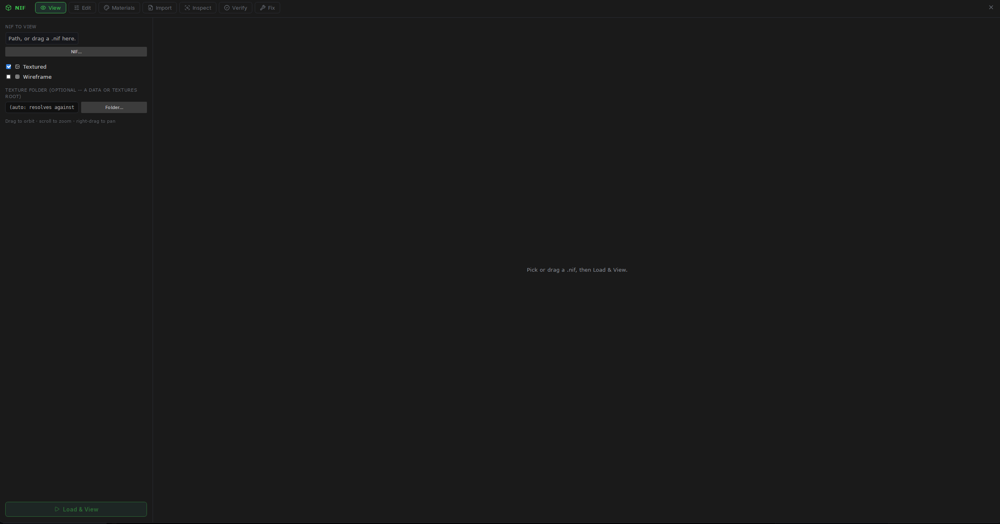
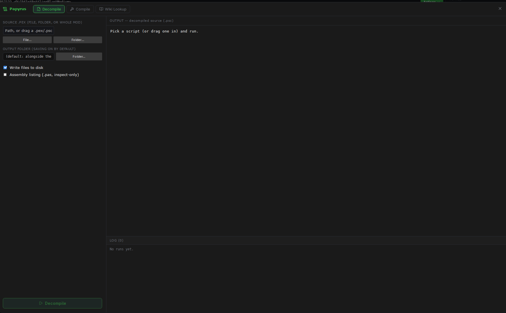
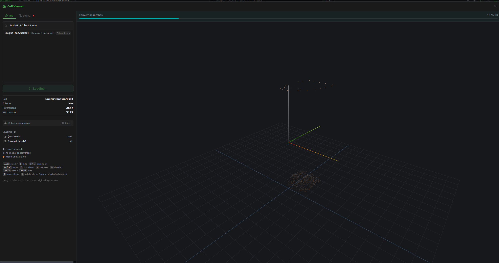

# FO4IDE

[Discord](https://discord.gg/cPmT8SmW4D)

FO4IDE is a Fallout 4 plugin IDE that reads and writes real `.esp`/`.esm`/`.esl` files. Two things
live in one executable:

- a **desktop editor** for browsing records across your load order, diffing and editing them,
  scanning conflicts, compiling and decompiling Papyrus, and inspecting NIFs
- an **MCP server** that gives an AI assistant the same operations: you describe the edit, the
  assistant makes it, and the plugin is written by
  [Mutagen](https://github.com/Mutagen-Modding/Mutagen) rather than by hand

It's built on a patched Mutagen, so it doesn't go through xEdit and doesn't need xEdit installed.
One codebase runs natively on Windows and Linux.

## Screenshots

The record editor, the visual Papyrus editor, and the game-asset panels. Click any image for the
full-size version.

| | | |
|---|---|---|
| [](images/editor.png)<br>Record editor | [](images/blueprint.png)<br>Blueprint editor | [](images/audio-panel.png)<br>Audio panel |
| [](images/archive-panel.png)<br>Archive panel | [](images/nif-viewer.png)<br>NIF viewer | [](images/papyrus-decompile.png)<br>Papyrus panel |
| [](images/cell-viewer.png)<br>Cell Viewer (WIP) | | |

The Cell Viewer is work in progress. It is available for early inspection of placed references in a
3D viewport, but its editing workflow and presentation are not release-complete yet.

## Install (Windows)

1. Install the **.NET 9 Desktop Runtime (x64)**. That's the only prerequisite.
2. Unzip the package anywhere, keeping the folder together (the exe loads `web\dist\` and `tools\`
   from beside itself).
3. Run `FO4RecordEditor.exe`.

FO4IDE retains the `FO4RecordEditor.exe` executable and configuration paths for compatibility with
existing installs and MCP client settings.

If you're editing a plugin that overrides mods, launch it **through Mod Organizer 2**
(Settings → Executables → Add from file). That's what lets it see your modlist's virtual Data
folder instead of the vanilla one.

Why no self-contained exe: MO2's virtual file system (usvfs) hooks file access, and a
self-contained .NET host can't load its bundled runtime through those hooks: the process dies
before any managed code runs. A framework-dependent build loads the shared runtime, which usvfs
handles fine.

## Linux

A native build exists: install the `FO4IDE_<version>_amd64.deb` release package or build it with
`packaging/linux/build-deb.sh`. Launch it from your applications menu or run `fo4ide` in a terminal.
Same code as Windows; the UI runs in a WebKitGTK
window instead of WebView2.

A few helper tools (niftool, texconv, Archive2, PapyrusCompiler, xWMAEncode) exist only as Windows
binaries, so installing Wine lets the panels that drive them work. Everything else is native:
Papyrus compiling has its own engine and doesn't need `PapyrusCompiler.exe`.

## Point an AI at it (MCP)

The editor speaks [MCP](https://modelcontextprotocol.io) over stdio. The full picture, covering
every tool and the rules that keep an assistant from corrupting plugins, is in
**[the MCP setup guide](https://github.com/G-A-R-D-E-N/FO4IDE/wiki/MCP_SETUP)**. The short version: drop a `.mcp.json` in your project
folder (a sample sits next to the exe as `mcp.sample.json`):

```jsonc
{
  "mcpServers": {
    "fo4editor": {
      "type": "stdio",
      "command": "C:\\Tools\\FO4RecordEditor\\FO4RecordEditor.exe",
      "args": ["--mcp", "--mo2", "C:\\Modlists\\My Modlist"]
    }
  }
}
```

- `--mcp` runs it headless as a server; the GUI never opens.
- `--mo2 <instance>` points it at an MO2 instance, so it reads the active profile's `plugins.txt`
  and reconstructs that exact load order.
- `--data <folder>` is the alternative: a plain `Data` folder, for a vanilla setup.

Use one or the other, then restart your AI client (or `/mcp reconnect` in Claude Code).

## Visual scripting

Papyrus scripts edit as node graphs: events, branches, calls and variables wired together instead
of text. Scripts open from compiled `.pex` files and compile back to them.

## Configuration

Settings live in `%APPDATA%\FO4RecordEditor\settings.json` and are all optional: every path is
auto-detected when blank. The GUI's settings panel covers them all, and each also honors an
environment variable that wins over the file: `NIFTOOL_PATH`, `TEXCONV_PATH`,
`PAPYRUS_COMPILER_PATH`, `PAPYRUS_BASE_IMPORTS`, `CK_WIKI_PATH`, `FFMPEG_PATH`,
`XWMAENCODE_PATH`, `ARCHIVE2_PATH`.

One caveat about Papyrus: `compile_papyrus` defaults to the Creation Kit's `PapyrusCompiler.exe`
when one is installed (it's not redistributable, so it never ships here) and falls back to a
built-in compiler otherwise. The built-in engine still needs the vanilla base script sources on its
import path. Those are plain `.psc` text; point `PAPYRUS_BASE_IMPORTS` at them. The
`papyrus_check` / `papyrus_outline` / `papyrus_definition` tools need nothing installed at all.

## What's in the box

```
FO4RecordEditor.exe     the editor + MCP server
web\dist\               the UI (WebView2 on Windows, WebKitGTK on Linux)
tools\niftool\          NIF authoring/repair CLI
tools\texconv\          DDS conversion fallback
tools\ckwiki\           offline Creation Kit Wiki mirror
tools\audio\            ffmpeg, xWMAEncode, BmlFuz (the audio_* tools)
mcp.sample.json         copy-paste MCP config
```

## Building it

Working on the tool rather than with it? Public setup and technical reference material lives in the
[FO4IDE wiki](https://github.com/G-A-R-D-E-N/FO4IDE/wiki).

## License

GPL-3.0, because it's built directly against Mutagen and embeds nifly, both GPL-3.0. See
[LICENSE](LICENSE), and [THIRD_PARTY_NOTICES.md](THIRD_PARTY_NOTICES.md) for the component list.
The package contains no Bethesda assets; it reads the game files you already own.

## Credits and thanks

FO4IDE is built for the Fallout 4 modding community. Thank you to Bethesda Game Studios for Fallout
4, the Mutagen project and nifly contributors for the libraries this tool builds on, and the F4SE,
xEdit, NifSkope, and Mod Organizer 2 communities for the tools and knowledge that make serious
plugin work possible.

Thank you as well to the mod authors, researchers, testers, and players who keep the ecosystem
moving forward.
